# Salt & Pepper Denoising — Karşılaştırmalı Çalışma

Tuz-biber gürültü giderme algoritmalarının **Tiny ImageNet-200** (1000 görsel, 64×64) ve **480p** (1000 görsel, 854×480) görüntü setleri üzerinde kapsamlı karşılaştırması.

## Yöntemler

| Yöntem | Tür | Dosya |
|---|---|---|
| SMF | Standart Medyan Filtresi | `run_SMF_levels.m` |
| AMF | Uyarlamalı Medyan Filtresi | `run_AMF_levels.m` |
| MDBUTMF | Modified Decision Based Unsymmetric Trimmed Median Filter | `run_MDBUTMF_levels.m` |
| EMPR | Efficient Multi-Pixel Reconstruction | `run_EMPR_levels.m` |
| HDMR | High-Density Median Reconstruction | `run_HDMR_levels.m` |
| DAMF | Decision-based Adaptive Median Filter | `run_DAMF_levels.m` |
| DnCNN | Derin Evrişimsel Ağ (L1, doğrudan) | `ai_based_models/` |
| DnCNN-SP | Maske koşullu DnCNN (4-kanal girdi) | `ai_based_models/` |
| SeConvUNet | Seçici Evrişimli U-Net | `ai_based_models/` |

## Değerlendirme Metrikleri

PSNR · SSIM · MAE · RMSE · Pixel-F1 / Precision / Recall · ResNet-18 Top-1 Accuracy

## Çalıştırma Sırası

### Tiny ImageNet

```
1. generate_all_noise_levels.m   → Tiny-Imagenet/Tiny_Noisy_{10,30,50,70,90}/
2. run_SMF_levels.m              → Tiny-Imagenet/Tiny_Cleaned_SMF_{10..90}/
   run_AMF_levels.m
   run_MDBUTMF_levels.m
   run_EMPR_levels.m
   run_HDMR_levels.m
   run_DAMF_levels.m
3. python ai_based_models/src/infer.py --config configs/dncnn_sp_v2.yaml --dataset tiny
   (DnCNN, DnCNN-SP, SeConvUNet için ayrı ayrı)
4. evaluate_all_metrics.ipynb    → sonuçlar + grafikler
```

### 480p

```
1. python resize_to_480p.py          → 480p-Test/Originals_resized/
2. generate_480p_noise.m             → 480p-Test/Noisy_{10,30,50,70,90}/
3. run_SMF_levels.m  (480p aktif)    → 480p-Test/Cleaned_SMF_{10..90}/
   run_AMF_levels.m
   run_MDBUTMF_levels.m
   run_EMPR_levels.m
   run_HDMR_levels.m
   run_DAMF_levels.m
4. python ai_based_models/src/infer.py --config configs/dncnn_sp_v2.yaml \
       --noisy_root 480p-Test --out_root 480p-Test --dataset 480p
5. evaluate_all_metrics.ipynb    → her iki set + karşılaştırma
```

## 480p Örnek Görseller

> Aşağıdaki görseller `make_readme_examples.py` çalıştırıldıktan sonra `docs/examples/v2/` klasöründe oluşur.
> Her satır soldan sağa: %10 · %30 · %50 · %70 · %90 gürültü seviyesi.

### Orijinal
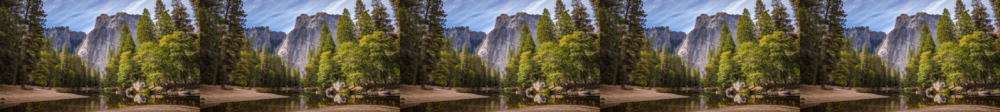

### Gürültülü (Noisy)
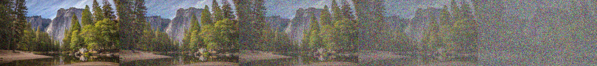

### SMF
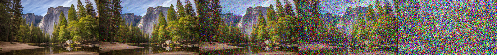

### AMF
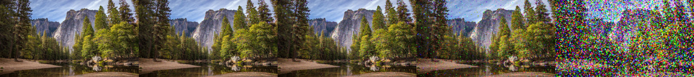

### MDBUTMF
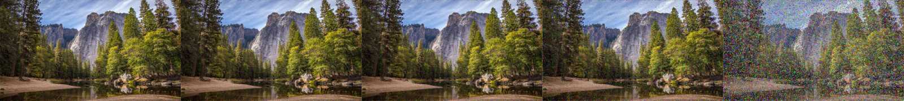

### EMPR
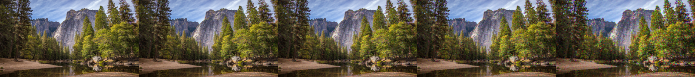

### HDMR
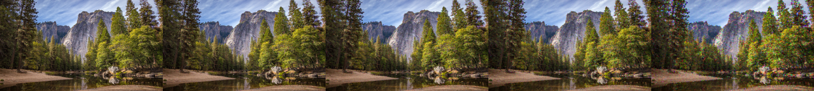

### DAMF
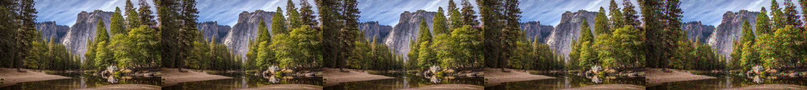

### DnCNN
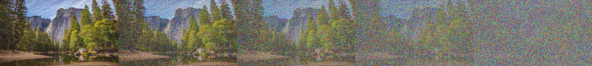

### DnCNN-SP
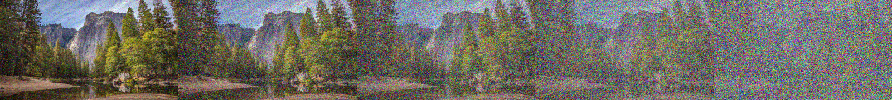

### SeConvUNet
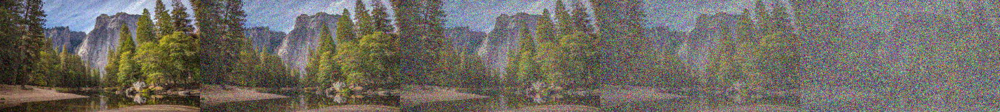

## Klasör Yapısı

```
noise-test/
├── Tiny-Imagenet/          ← Tiny ImageNet gürültülü + temizlenmiş görüntüler
├── 480p-Test/              ← 480p gürültülü + temizlenmiş görüntüler
├── tiny-imagenet-200/      ← Eğitim verisi (DL modeller)
├── ai_based_models/        ← Python kaynak kodu
│   ├── src/
│   └── configs/
├── evaluate_all_metrics.ipynb
├── generate_all_noise_levels.m
├── generate_480p_noise.m
├── resize_to_480p.py
└── run_*_levels.m
```
